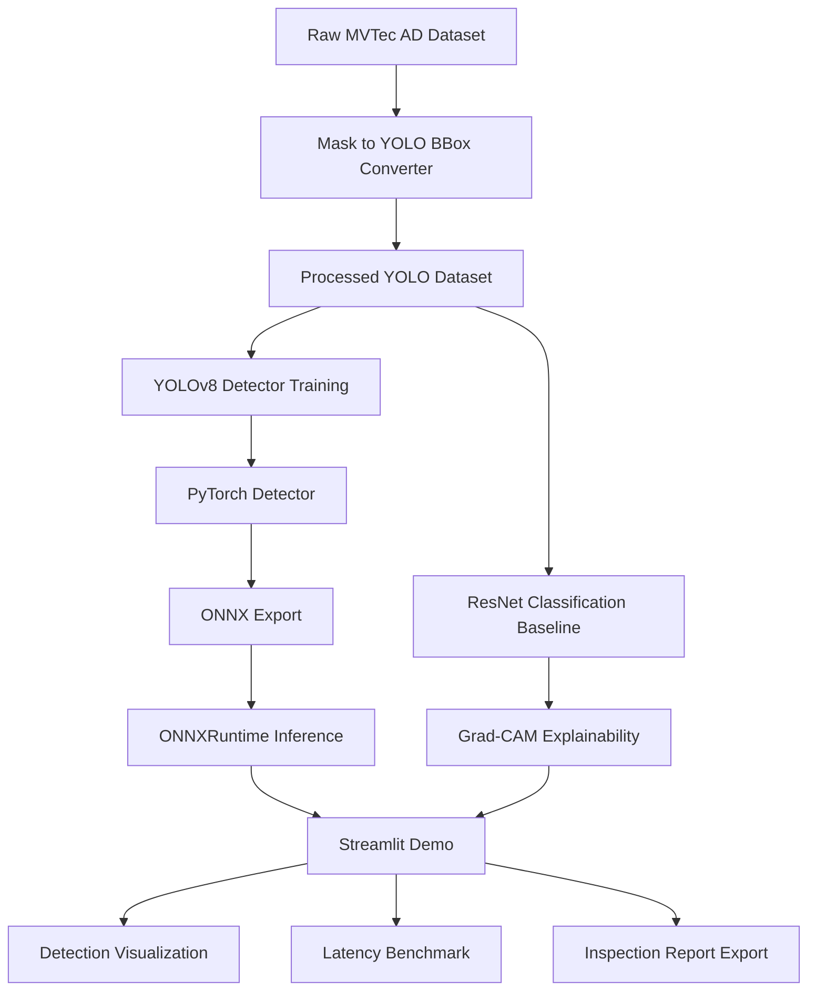

# Industrial-Defect-CV-System

An end-to-end industrial surface defect detection system built with PyTorch, YOLOv8, ResNet, Grad-CAM, ONNXRuntime, and Streamlit.

This repository is a public, anonymized engineering demo extracted from real industrial visual inspection experience. It demonstrates a complete workflow for defect detection, classification, explainability, deployment, latency profiling, and visual reporting.

---

## 1. Project Highlights

* End-to-end industrial defect detection pipeline
* MVTec AD mask-to-bounding-box conversion for supervised detection demo
* YOLOv8-based defect localization
* ResNet classification baseline for normal / defect and defect-type classification
* Grad-CAM explainability for model decision visualization
* ONNX export and latency benchmark
* Streamlit web demo for image upload, detection, visualization, and report export
* Engineering-style repository structure suitable for interview demonstration

---

## 2. Why This Project

Industrial visual inspection is different from generic object detection. It often faces:

* small defects
* weak texture differences
* reflective surfaces
* limited defective samples
* high false-positive cost
* strict latency requirements
* deployment on constrained hardware

This project focuses not only on model accuracy, but also on data processing, inference latency, visualization, deployment, and explainability.

---

## 3. System Architecture



---

## 4. Tech Stack

| Module              | Tools                                        |
| ------------------- | -------------------------------------------- |
| Deep Learning       | PyTorch, Ultralytics YOLOv8, torchvision     |
| Classification      | ResNet18 / ResNet34                          |
| Explainability      | Grad-CAM                                     |
| Deployment          | ONNX, ONNXRuntime                            |
| Visualization       | Streamlit, OpenCV, Matplotlib                |
| Experiment Tracking | TensorBoard / CSV logs                       |
| Engineering         | Docker, YAML configs, modular Python package |

---

## 5. Dataset

This project uses a subset of MVTec AD for a supervised defect detection demo.

Recommended MVP categories:

```text
bottle
capsule
metal_nut
```

The original MVTec AD dataset provides pixel-level anomaly masks. This project converts those masks into YOLO-style bounding boxes.

Important note:

This repository uses MVTec AD masks to create bounding boxes for a supervised detection demo. It does not claim official SOTA anomaly detection performance under the original MVTec AD benchmark protocol.

---

## 6. Dataset Preparation

This project uses a 3-category subset of MVTec AD for the MVP demo:

- bottle
- capsule
- metal_nut

The dataset is stored locally under:

```text
data/raw/mvtec_ad/
```

Download and extract the subset:

```bash
python scripts/download_mvtec_subset.py
```

Verify the dataset structure:

```bash
python scripts/check_mvtec_dataset.py
```

Expected structure:

```text
data/raw/mvtec_ad/
├── bottle/
│   ├── train/
│   ├── test/
│   └── ground_truth/
├── capsule/
│   ├── train/
│   ├── test/
│   └── ground_truth/
└── metal_nut/
    ├── train/
    ├── test/
    └── ground_truth/
```

Note:

MVTec AD is originally an anomaly detection dataset. In this project, the pixel-level masks are converted into YOLO-style bounding boxes for a supervised industrial defect detection demo.

---

## 7. Repository Structure

```text
Industrial-Defect-CV-System/
├── configs/
├── data/
├── docs/
├── notebooks/
├── scripts/
├── src/defect_cv/
├── app/
├── outputs/
└── tests/
```

---

## 8. Quick Start

### 8.1 Create Environment

```bash
conda create -n defect-cv python=3.10 -y
conda activate defect-cv
pip install -r requirements.txt
```

### 8.2 Prepare Dataset

Convert MVTec masks to YOLO labels:

```bash
python scripts/prepare_mvtec.py \
  --raw_dir data/raw/mvtec_ad \
  --out_dir data/processed/mvtec_yolo \
  --categories bottle capsule metal_nut \
  --task defect_detection
```

Visualize converted labels:

```bash
python scripts/mask_to_yolo_bbox.py \
  --data_dir data/processed/mvtec_yolo \
  --vis_samples 50
```

---

## 9. Train YOLOv8 Detector

```bash
python scripts/train_yolo.py \
  --data configs/dataset/yolo_mvtec.yaml \
  --model yolov8n.pt \
  --imgsz 768 \
  --epochs 50 \
  --batch 8 \
  --project outputs/checkpoints/yolo
```

Validate:

```bash
python scripts/eval_yolo.py \
  --weights outputs/checkpoints/yolo/best.pt \
  --data configs/dataset/yolo_mvtec.yaml
```

---

## 10. Train ResNet Classification Baseline

```bash
python scripts/train_resnet.py \
  --config configs/train/resnet_train.yaml \
  --model resnet18 \
  --epochs 30 \
  --batch 32
```

Evaluate:

```bash
python scripts/eval_resnet.py \
  --weights outputs/checkpoints/resnet/best.pth \
  --data data/processed/classification
```

---

## 11. Grad-CAM Explainability

```bash
python scripts/generate_report.py \
  --image data/samples/defect/sample_001.png \
  --resnet_weights outputs/checkpoints/resnet/best.pth \
  --enable_gradcam
```

Output:

```text
outputs/reports/
├── sample_001_prediction.png
├── sample_001_gradcam.png
└── sample_001_report.md
```

---

## 12. Export to ONNX

```bash
python scripts/export_onnx.py \
  --weights outputs/checkpoints/yolo/best.pt \
  --imgsz 768 \
  --output outputs/exported/yolov8_defect.onnx
```

---

## 13. Latency Benchmark

```bash
python scripts/benchmark_latency.py \
  --model outputs/exported/yolov8_defect.onnx \
  --runtime onnxruntime \
  --image_dir data/samples/defect \
  --imgsz 768 \
  --warmup 50 \
  --repeat 200
```

Benchmark template:

| Model   | Runtime     | Device | Image Size | Precision | p50 Latency | p95 Latency | FPS | Model Size |
| ------- | ----------- | ------ | ---------- | --------- | ----------: | ----------: | --: | ---------: |
| YOLOv8n | PyTorch     | CUDA   | 768        | FP32      |         TBD |         TBD | TBD |        TBD |
| YOLOv8n | ONNXRuntime | CUDA   | 768        | FP32      |         TBD |         TBD | TBD |        TBD |
| YOLOv8n | ONNXRuntime | CPU    | 768        | FP32      |         TBD |         TBD | TBD |        TBD |

---

## 14. Streamlit Demo

```bash
streamlit run app/streamlit_app.py
```

Demo workflow:

```text
Upload image
→ Run YOLOv8 defect detection
→ Show bounding boxes and confidence
→ Run ResNet classification
→ Generate Grad-CAM heatmap
→ Export inspection report
```

Demo GIF:

```text
docs/assets/demo.gif
```


---

## 15. Results

Detection benchmark:

| Model   | Categories               | mAP50 | Precision | Recall |  F1 | Notes        |
| ------- | ------------------------ | ----: | --------: | -----: | --: | ------------ |
| YOLOv8n | bottle/capsule/metal_nut |   TBD |       TBD |    TBD | TBD | MVP baseline |
| YOLOv8s | bottle/capsule/metal_nut |   TBD |       TBD |    TBD | TBD | Optional     |

Classification benchmark:

| Model    | Task             | Accuracy | Macro-F1 | Recall | Notes    |
| -------- | ---------------- | -------: | -------: | -----: | -------- |
| ResNet18 | normal vs defect |      TBD |      TBD |    TBD | baseline |
| ResNet18 | defect type      |      TBD |      TBD |    TBD | optional |

---

## 16. Error Analysis

Typical failure cases to analyze:

* small defect missed after image resizing
* reflective highlight mistaken as defect
* weak texture difference causing low confidence
* background edge causing false positive
* defect mask converted to noisy bounding box

---

## 17. Deployment Notes

This project provides a lightweight deployment path:

```text
PyTorch checkpoint
→ ONNX export
→ ONNXRuntime inference
→ latency benchmark
→ Streamlit demo
```

Future deployment extensions:

* TensorRT engine export
* FP16 inference
* INT8 quantization
* model pruning
* C++ inference demo
* Qt-based industrial client

---

## 18. Interview Talking Points

This project demonstrates:

1. How to convert industrial segmentation-style annotations into detection labels.
2. How to design augmentations for small defects, weak textures, reflection, and class imbalance.
3. Why detection and classification baselines should be compared.
4. How Grad-CAM helps with industrial model acceptance.
5. How to evaluate deployment readiness using ONNX latency benchmark.
6. Why industrial CV requires both algorithm accuracy and software engineering.

---

## 19. Roadmap

* [ ] Add TensorRT benchmark
* [ ] Add INT8 quantization
* [ ] Add hard negative mining
* [ ] Add active learning loop
* [ ] Add Qt/C++ demo client
* [ ] Add model version management
* [ ] Add defect report PDF export
