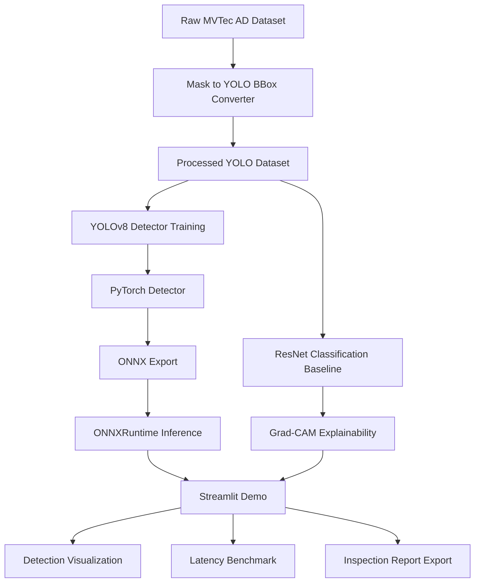

# Industrial-Defect-CV-System

Industrial-Defect-CV-System is an end-to-end industrial surface defect detection MVP.

It demonstrates a complete engineering workflow:

- MVTec AD dataset conversion
- YOLOv8 defect detection
- ResNet classification baseline
- Grad-CAM explainability
- ONNX export
- latency benchmark
- Streamlit visualization

This repository is designed as a public and anonymized engineering reproduction of industrial CV experience.

---

## MVP Scope

Day1 focuses on:

- GitHub-ready project skeleton
- isolated conda environment
- configuration files
- placeholder scripts
- basic tests
- Streamlit placeholder app

No training is implemented on Day1.

---

## Architecture



---

## Project Structure

```text
configs/
data/
docs/
scripts/
src/defect_cv/
app/
outputs/
tests/
```

---

## Environment Setup

```bash
conda create -n defect-cv python=3.10 -y
conda activate defect-cv
pip install -r requirements.txt
```

Verify:

```bash
which python
pytest -q
```

---

## Streamlit Demo

```bash
streamlit run app/streamlit_app.py
```

---

## Day1 Status

* [x] Project skeleton
* [x] Conda environment
* [x] Git initialization
* [x] Placeholder scripts
* [x] Basic tests
* [ ] Dataset preparation
* [ ] YOLOv8 training
* [ ] ResNet baseline
* [ ] Grad-CAM
* [ ] ONNX export
* [ ] latency benchmark