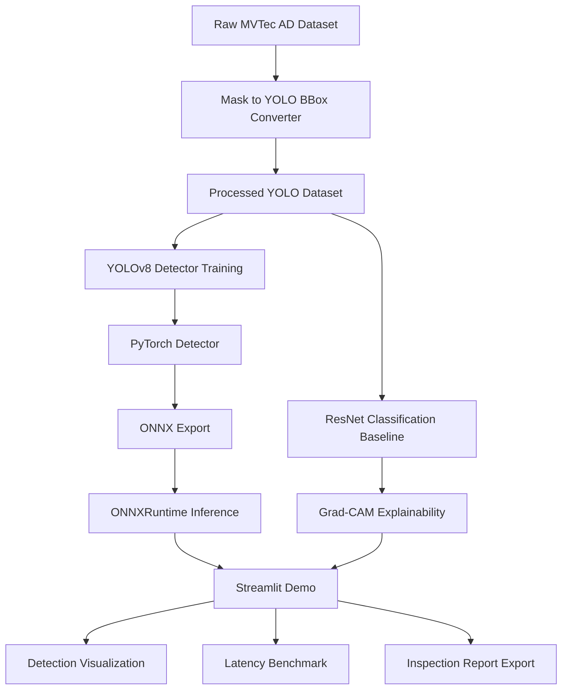

# Cline Day1 Task: Setup Industrial-Defect-CV-System Project Skeleton and Conda Environment

## 0. Role

You are an experienced Python / PyTorch / Computer Vision engineering assistant.

Your task is to initialize a clean GitHub-ready project skeleton for an industrial defect detection system on an AutoDL remote server.

This is Day 1 of a 5-day MVP project. Do not implement full training logic today. Focus on:

1. correct project directory structure
2. clean conda virtual environment
3. GitHub-friendly repository management
4. basic config / placeholder files
5. sanity checks to ensure the environment is isolated and usable

---

## 1. Hard Requirements

Project root must be:

```bash
/root/autodl-tmp/Industrial-Defect-CV-System
```

Conda environment name must be:

```bash
defect-cv
```

Python version:

```bash
python=3.10
```

Important constraints:

* Do not pollute the base conda environment.
* Do not install packages into `base`.
* Do not use `pip install` outside the `defect-cv` environment.
* Do not put large datasets, checkpoints, logs, or model weights into Git.
* Do not download MVTec AD today unless explicitly requested later.
* Do not start model training today.
* Do not create unnecessary complicated code.
* Keep the project clean, professional, and GitHub-ready.

---

## 2. First, Inspect the Server

Run the following checks and summarize the results in a file named:

```bash
docs/day1_environment_check.md
```

Commands to run:

```bash
whoami
pwd
ls -lah /root/autodl-tmp
conda --version
python --version
nvidia-smi || true
nvcc --version || true
git --version
```

Also check whether `/root/autodl-tmp` has enough disk space:

```bash
df -h /root/autodl-tmp
```

Expected result:

* Confirm current user.
* Confirm `/root/autodl-tmp` exists.
* Confirm CUDA/GPU status if available.
* Confirm conda and git are available.

---

## 3. Create Project Root

Create the project folder:

```bash
mkdir -p /root/autodl-tmp/Industrial-Defect-CV-System
cd /root/autodl-tmp/Industrial-Defect-CV-System
```

Initialize Git:

```bash
git init
git branch -M main
```

Do not add a remote yet. I will add the GitHub remote manually later.

---

## 4. Create Conda Environment

Create an isolated conda environment:

```bash
conda create -n defect-cv python=3.10 -y
```

Activate it:

```bash
conda activate defect-cv
```

Verify isolation:

```bash
which python
python --version
which pip
pip --version
conda env list
```

The active Python path must belong to:

```bash
defect-cv
```

If the environment already exists, do not recreate it destructively. Instead:

1. activate it
2. verify Python version
3. continue setup

---

## 5. Install Minimal Day1 Dependencies

Inside the `defect-cv` environment only, install minimal dependencies needed for project skeleton validation.

Install these via pip:

```bash
pip install -U pip
pip install numpy pandas opencv-python pillow matplotlib pyyaml tqdm rich loguru pytest black isort streamlit onnx onnxruntime
pip install ultralytics
```

For PyTorch:

First check if PyTorch is already available in this environment:

```bash
python -c "import torch; print(torch.__version__); print(torch.cuda.is_available())" || true
```

If PyTorch is not installed, install a CUDA-compatible version. Prefer the official PyTorch install command suitable for the server CUDA version. If unsure, install the common CUDA 12.1 version:

```bash
pip install torch torchvision torchaudio --index-url https://download.pytorch.org/whl/cu121
```

After installation, verify:

```bash
python - <<'PY'
import sys
print("Python:", sys.executable)

import torch
print("Torch:", torch.__version__)
print("CUDA available:", torch.cuda.is_available())
if torch.cuda.is_available():
    print("GPU:", torch.cuda.get_device_name(0))

import cv2
print("OpenCV:", cv2.__version__)

import ultralytics
print("Ultralytics:", ultralytics.__version__)

import onnxruntime as ort
print("ONNXRuntime:", ort.__version__)
PY
```

Save the output summary into:

```bash
docs/day1_environment_check.md
```

---

## 6. Create Repository Directory Structure

Create the following exact structure:

```text
Industrial-Defect-CV-System/
├── README.md
├── LICENSE
├── requirements.txt
├── environment.yml
├── pyproject.toml
├── .gitignore
├── .env.example
├── docker/
│   ├── Dockerfile
│   └── docker-compose.yml
├── configs/
│   ├── dataset/
│   │   ├── mvtec_subset.yaml
│   │   └── yolo_mvtec.yaml
│   ├── model/
│   │   ├── yolo_v8n.yaml
│   │   └── resnet18.yaml
│   └── train/
│       ├── yolo_train.yaml
│       └── resnet_train.yaml
├── data/
│   ├── raw/
│   │   └── .gitkeep
│   ├── processed/
│   │   ├── images/
│   │   │   └── .gitkeep
│   │   ├── labels/
│   │   │   └── .gitkeep
│   │   └── dataset.yaml
│   └── samples/
│       ├── normal/
│       │   └── .gitkeep
│       └── defect/
│           └── .gitkeep
├── docs/
│   ├── architecture.md
│   ├── dataset_conversion.md
│   ├── benchmark.md
│   ├── deployment.md
│   ├── interview_notes.md
│   └── day1_environment_check.md
├── notebooks/
│   ├── 01_dataset_eda.ipynb
│   ├── 02_error_analysis.ipynb
│   └── 03_gradcam_visualization.ipynb
├── scripts/
│   ├── prepare_mvtec.py
│   ├── mask_to_yolo_bbox.py
│   ├── train_yolo.py
│   ├── train_resnet.py
│   ├── eval_yolo.py
│   ├── eval_resnet.py
│   ├── export_onnx.py
│   ├── benchmark_latency.py
│   └── generate_report.py
├── src/
│   └── defect_cv/
│       ├── __init__.py
│       ├── data/
│       │   ├── __init__.py
│       │   ├── dataset.py
│       │   ├── transforms.py
│       │   ├── imbalance.py
│       │   └── converters.py
│       ├── models/
│       │   ├── __init__.py
│       │   ├── yolo_detector.py
│       │   ├── resnet_classifier.py
│       │   └── model_registry.py
│       ├── training/
│       │   ├── __init__.py
│       │   ├── trainer_yolo.py
│       │   ├── trainer_resnet.py
│       │   ├── callbacks.py
│       │   └── metrics.py
│       ├── explainability/
│       │   ├── __init__.py
│       │   └── gradcam.py
│       ├── deployment/
│       │   ├── __init__.py
│       │   ├── onnx_exporter.py
│       │   ├── onnx_infer.py
│       │   └── latency_profiler.py
│       ├── visualization/
│       │   ├── __init__.py
│       │   ├── draw_bbox.py
│       │   ├── draw_heatmap.py
│       │   └── report.py
│       └── utils/
│           ├── __init__.py
│           ├── logger.py
│           ├── seed.py
│           └── paths.py
├── app/
│   ├── streamlit_app.py
│   ├── pages/
│   │   ├── 1_Detection.py
│   │   ├── 2_GradCAM.py
│   │   └── 3_Benchmark.py
│   └── assets/
│       └── demo_placeholder.gif
├── outputs/
│   ├── checkpoints/
│   │   └── .gitkeep
│   ├── logs/
│   │   └── .gitkeep
│   ├── reports/
│   │   └── .gitkeep
│   ├── predictions/
│   │   └── .gitkeep
│   └── exported/
│       └── .gitkeep
└── tests/
    ├── test_dataset.py
    ├── test_mask_to_bbox.py
    ├── test_onnx_infer.py
    └── test_latency_profiler.py
```

---

## 7. Create `.gitignore`

Create a strict `.gitignore` suitable for machine learning projects.

It must ignore:

```gitignore
# Python
__pycache__/
*.py[cod]
*.so
.pytest_cache/
.mypy_cache/
.ruff_cache/
.ipynb_checkpoints/

# Environments
.env
.venv/
venv/
env/
*.env

# IDE
.vscode/
.idea/

# OS
.DS_Store

# Data
data/raw/*
data/processed/*
!data/raw/.gitkeep
!data/processed/images/.gitkeep
!data/processed/labels/.gitkeep
!data/processed/dataset.yaml
!data/samples/normal/.gitkeep
!data/samples/defect/.gitkeep

# Outputs
outputs/checkpoints/*
outputs/logs/*
outputs/reports/*
outputs/predictions/*
outputs/exported/*
!outputs/checkpoints/.gitkeep
!outputs/logs/.gitkeep
!outputs/reports/.gitkeep
!outputs/predictions/.gitkeep
!outputs/exported/.gitkeep

# Model artifacts
*.pt
*.pth
*.onnx
*.engine
*.trt
*.weights
*.ckpt

# Logs
*.log
runs/
wandb/
mlruns/

# Temporary
tmp/
temp/
.cache/
```

---

## 8. Create `requirements.txt`

Generate `requirements.txt` from installed packages, but keep it clean and human-readable.

Use this as the initial content:

```txt
numpy
pandas
opencv-python
pillow
matplotlib
pyyaml
tqdm
rich
loguru
pytest
black
isort
streamlit
torch
torchvision
ultralytics
onnx
onnxruntime
```

Do not pin exact versions today unless necessary.

---

## 9. Create `environment.yml`

Create:

```yaml
name: defect-cv
channels:
  - defaults
  - conda-forge
dependencies:
  - python=3.10
  - pip
  - pip:
      - numpy
      - pandas
      - opencv-python
      - pillow
      - matplotlib
      - pyyaml
      - tqdm
      - rich
      - loguru
      - pytest
      - black
      - isort
      - streamlit
      - torch
      - torchvision
      - ultralytics
      - onnx
      - onnxruntime
```

---

## 10. Create `pyproject.toml`

Create a simple project config:

```toml
[project]
name = "industrial-defect-cv-system"
version = "0.1.0"
description = "End-to-end industrial defect detection system with YOLOv8, ResNet, Grad-CAM, ONNX and Streamlit."
readme = "README.md"
requires-python = ">=3.10"

[tool.black]
line-length = 100
target-version = ["py310"]

[tool.isort]
profile = "black"
line_length = 100

[tool.pytest.ini_options]
testpaths = ["tests"]
pythonpath = ["src"]
```

---

## 11. Create `.env.example`

Create:

```bash
PROJECT_ROOT=/root/autodl-tmp/Industrial-Defect-CV-System
DATA_ROOT=/root/autodl-tmp/Industrial-Defect-CV-System/data
OUTPUT_ROOT=/root/autodl-tmp/Industrial-Defect-CV-System/outputs
DEVICE=cuda
SEED=42
```

---

## 12. Create Basic Config Files

### `configs/dataset/mvtec_subset.yaml`

```yaml
dataset_name: mvtec_ad_subset
raw_dir: data/raw/mvtec_ad
processed_dir: data/processed/mvtec_yolo
categories:
  - bottle
  - capsule
  - metal_nut
task: defect_detection
label_mode: binary_defect
train_ratio: 0.8
val_ratio: 0.1
test_ratio: 0.1
seed: 42
```

### `configs/dataset/yolo_mvtec.yaml`

```yaml
path: data/processed/mvtec_yolo
train: images/train
val: images/val
test: images/test

names:
  0: defect
```

### `configs/model/yolo_v8n.yaml`

```yaml
model_name: yolov8n
weights: yolov8n.pt
task: detect
num_classes: 1
input_size: 768
```

### `configs/model/resnet18.yaml`

```yaml
model_name: resnet18
pretrained: true
num_classes: 2
classes:
  - normal
  - defect
input_size: 224
```

### `configs/train/yolo_train.yaml`

```yaml
model: yolov8n.pt
data: configs/dataset/yolo_mvtec.yaml
imgsz: 768
epochs: 50
batch: 8
optimizer: AdamW
lr0: 0.001
weight_decay: 0.0005
patience: 15
cos_lr: true
workers: 4
seed: 42
project: outputs/checkpoints/yolo
```

### `configs/train/resnet_train.yaml`

```yaml
model: resnet18
data_dir: data/processed/classification
epochs: 30
batch_size: 32
lr: 0.001
weight_decay: 0.0001
num_classes: 2
input_size: 224
seed: 42
output_dir: outputs/checkpoints/resnet
```

---

## 13. Create Minimal Python Placeholder Files

For all Python files in `scripts/`, create safe placeholder CLI files that do not train or download anything today.

Each script should:

1. have a clear docstring
2. print what it is supposed to do
3. exit successfully
4. not perform heavy operations

Example style:

```python
"""
Day1 placeholder script.

This file will be implemented in later MVP stages.
"""

def main():
    print("This is a placeholder. Implementation will be added later.")

if __name__ == "__main__":
    main()
```

For `src/defect_cv/utils/seed.py`, implement a small real utility:

```python
import random
import numpy as np

def set_seed(seed: int = 42) -> None:
    random.seed(seed)
    np.random.seed(seed)
    try:
        import torch
        torch.manual_seed(seed)
        torch.cuda.manual_seed_all(seed)
    except Exception:
        pass
```

For `src/defect_cv/utils/paths.py`, implement:

```python
from pathlib import Path

PROJECT_ROOT = Path(__file__).resolve().parents[3]
DATA_DIR = PROJECT_ROOT / "data"
OUTPUT_DIR = PROJECT_ROOT / "outputs"
CONFIG_DIR = PROJECT_ROOT / "configs"
```

For `src/defect_cv/utils/logger.py`, implement a simple loguru logger wrapper.

---

## 14. Create Minimal Streamlit App

Create `app/streamlit_app.py` with a minimal placeholder page.

It should show:

* project title
* project purpose
* Day1 status
* planned modules
* warning that model training is not implemented yet

Do not implement real inference today.

The app should run with:

```bash
streamlit run app/streamlit_app.py
```

---

## 15. Create README.md

Create a professional initial README.

It must include:

1. project title
2. short positioning
3. MVP scope
4. architecture Mermaid diagram
5. repository structure
6. conda environment setup
7. Day1 status
8. next steps

Use this positioning:

```text
Industrial-Defect-CV-System is an end-to-end industrial surface defect detection MVP.
It demonstrates a complete engineering workflow: dataset conversion, YOLOv8 detection,
ResNet classification baseline, Grad-CAM explainability, ONNX deployment, latency benchmark,
and Streamlit visualization.
```

Include this Mermaid diagram:



---

## 16. Create Documentation Files

Create concise but useful placeholder docs.

### `docs/architecture.md`

Explain the planned architecture:

```text
data layer
model layer
explainability layer
deployment layer
demo layer
```

### `docs/dataset_conversion.md`

Explain:

```text
MVTec AD masks will be converted to YOLO bounding boxes.
This project uses MVTec AD for supervised detection demo, not official anomaly detection benchmark.
```

### `docs/benchmark.md`

Create benchmark table templates:

```markdown
| Model | Runtime | Device | Image Size | Precision | p50 Latency | p95 Latency | FPS | Model Size |
|---|---|---|---|---|---:|---:|---:|---:|
| YOLOv8n | PyTorch | CUDA | 768 | FP32 | TBD | TBD | TBD | TBD |
| YOLOv8n | ONNXRuntime | CUDA | 768 | FP32 | TBD | TBD | TBD | TBD |
```

### `docs/deployment.md`

Explain planned deployment path:

```text
PyTorch checkpoint → ONNX export → ONNXRuntime inference → latency benchmark → Streamlit demo
```

### `docs/interview_notes.md`

Add a short interview framing:

```text
This project is designed as a public, anonymized engineering reproduction of real industrial CV experience.
It is not a toy YOLO demo. It focuses on industrial constraints: small defects, weak textures,
reflective surfaces, class imbalance, false positives, deployment latency, and visual reporting.
```

---

## 17. Create Minimal Tests

Create simple tests that verify project imports and paths.

### `tests/test_dataset.py`

Should check that `configs/dataset/mvtec_subset.yaml` exists.

### `tests/test_mask_to_bbox.py`

Placeholder test that passes with a clear TODO.

### `tests/test_onnx_infer.py`

Placeholder test that passes with a clear TODO.

### `tests/test_latency_profiler.py`

Placeholder test that passes with a clear TODO.

Run:

```bash
pytest -q
```

Expected result:

```text
all tests passed
```

---

## 18. Final Validation Commands

Run these commands from project root:

```bash
pwd
conda info --envs
which python
python --version
python -c "import torch; print('torch', torch.__version__, 'cuda', torch.cuda.is_available())"
python -c "import ultralytics; print('ultralytics', ultralytics.__version__)"
pytest -q
streamlit run app/streamlit_app.py --server.headless true --server.port 8501
```

For the Streamlit command, it is okay to stop the process after confirming it starts successfully.

---

## 19. Git Initial Commit

After validation, run:

```bash
git status
git add .
git commit -m "chore: initialize industrial defect CV project skeleton"
```

If Git user identity is not configured, set local repo identity only:

```bash
git config user.name "Delman"
git config user.email "delman@example.com"
```

Do not configure global Git identity unless explicitly asked.

---

## 20. Final Response Required from Cline

After finishing, provide a concise summary with:

1. project path
2. conda env name
3. Python path
4. whether CUDA is available
5. whether pytest passed
6. whether Streamlit started
7. Git commit hash
8. any issues encountered

Do not proceed to Day2 tasks unless asked.
